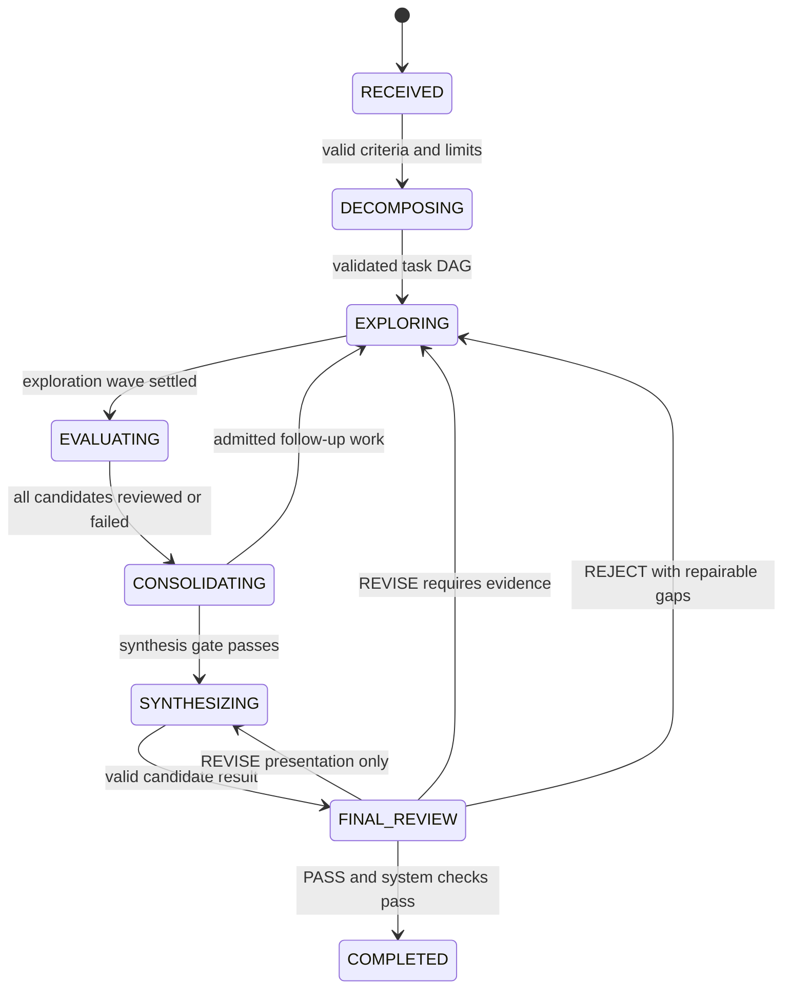

# Swarm architecture review and proposed MVP design

Date: 2026-09-09. Status: architecture approved with amendments in `INSTRUCTIONS/implementation-prompt-stages-1-3.md`. Stages 1–3 are implemented; see `docs/stages-1-3-report.md`. This document describes the full planned architecture, including unimplemented later stages.

## 1. Repository findings

The inspected workspace is `/home/taz/agents`. A recursive filesystem inventory, including hidden entries, found this complete pre-review tree:

```text
/home/taz/agents/
├── .agents/                       empty
├── .codex/                        empty
├── .git/                          empty; not a valid Git repository
└── INSTRUCTIONS/
    └── kickoff-prompt-for-swarm-implementation.md
```

`git status --short` failed with “not a git repository.” There are no commits or tracked files available to audit here. No source code, language declaration, dependency or build configuration, tests, schemas, prompts directory, agent definitions, orchestration files, README, or on-disk AGENTS.md exists. The AGENTS.md text supplied in the conversation contains only an empty recent-activity section.

The kickoff document was read in full. It is a requirements brief, not evidence of implemented functionality. This review is grounded in that brief and the subsequent architecture-phase request. No runtime tests can be run because no implementation or test suite exists. No other checkout was assumed to be the intended repository.

At the original inspection checkpoint, this review document was the only addition made during that phase. No implementation, scaffolding, configuration, dependency installation, or Git initialization was performed.

## 2. Architecture gap analysis

Statuses below describe executable capability. Conceptual requirements alone do not qualify as a partial implementation.

| Component | Status | Evidence and gap |
|---|---|---|
| Requirements brief | EXISTS | The kickoff prompt describes the desired architecture and MVP loop. |
| Architecture specification | PARTIAL | Intent is documented; contracts, guards, failure semantics, and storage rules were absent before this proposal. |
| Objective / Run | MISSING | No run record, acceptance criteria, resource limits, or result contract. |
| Orchestrator | MISSING | No executable decomposition, scheduling, state machine, or policy interfaces. |
| Tasks | MISSING | No typed task graph, dependency checks, or task lifecycle. |
| Agents and roles | MISSING | Role names and agent attributes are listed but have no executable definitions. |
| Findings | MISSING | Suggested fields/states exist only in prose; evidence and acceptance rules are undefined. |
| Criticism | MISSING | No review output contract or obligation to address blocking critiques. |
| Validation | MISSING | No independent checking mechanism or evidence standard. |
| Consolidation | MISSING | No deduplication, provenance preservation, or conflict handling. |
| Cross-pollination | MISSING | Selective propagation is requested; eligibility and relevance rules are unspecified. |
| Synthesis | MISSING | No result structure or claim-to-evidence links. |
| Final review | MISSING | PASS/REVISE/REJECT are suggested without guarded transitions or retry limits. |
| Messaging and groups | MISSING | No routing, membership, access rules, or delivery semantics. |
| Shared state | MISSING | Desired contents are listed; promotion and context-selection rules are absent. |
| Provider and tool boundaries | MISSING | Narrow interfaces are requested, but no implementations or contracts exist. |
| Persistence and observability | MISSING | No events, storage, inspection interface, or persisted runs. |
| Tests and execution example | MISSING | No runnable command or test suite. |
| Information-flow diagram | SHOULD_CHANGE | Events are an audit layer covering operations, not a mandatory precursor from which all messages and findings must be derived. |

There is no code in which the five unwanted coupling patterns can currently be observed. Their absence is not proof that they have been prevented. Proposed safeguards are:

| Coupling risk | Boundary |
|---|---|
| Agent permanently bound to a role | Agent identity and provider remain separate from a replaceable role assignment. Reassignment occurs only while idle. |
| Role bound to model provider | Role contains instructions, schemas, and permissions; provider selection belongs to agent configuration. |
| Orchestration embedded in prompts | Models propose findings, subtasks, and reviews. A deterministic controller owns transitions, acceptance, budgets, and routing. |
| Messaging equals raw transcript | Message has typed purpose, sender, recipient, compact payload, and references. Provider transcripts are private execution artifacts. |
| Shared state equals conversation history | Shared state contains bounded indexes, summaries, and references selected through explicit promotion rules. |

Important ambiguities to resolve in the design are what “independent validation” proves, how contradictory findings affect synthesis, who authorizes new work, how many reconsideration cycles are allowed, whether role tools imply runtime enforcement, and whether persistence promises resumption. The decisions below address all of these without adding distributed infrastructure.

## 3. Approach and core domain model

### Approach options

1. **Recommended: typed Python package, one async process, deterministic controller.** Small interfaces and serial state mutation allow concurrent model calls while making outcomes inspectable and fake-provider tests deterministic. Python is a proposal; the workspace establishes no language preference.
2. **Thin prompt pipeline.** Fewer initial files, but weak task/finding identity and lifecycle enforcement would undermine the requested experiments.
3. **General graph/workflow engine.** More scheduling and persistence machinery upfront; unnecessary before one bounded swarm loop works.

Use standard-library dataclasses/enums and explicit boundary validation initially, with a narrow adapter for serialization. Avoid a plugin framework and deep inheritance. Serialized records carry `schema_version`; identifiers are run-local or globally unique opaque strings, timestamps are UTC, and all mutable records have a monotonic revision. Enum strings are stable serialized values.

Required fields may default to empty collections when that is meaningful. “Optional” means absent/null is allowed. Referential integrity and legal transitions are checked by the controller; model output never directly mutates records.

| Object | Purpose and required fields | Optional fields | Lifecycle and relationships |
|---|---|---|---|
| **Agent** | Reusable worker identity. `id`, `run_id`, `provider_key`, `status`, `permissions` | `role_id`, `assignment_id`, `group_id`, private history reference | `IDLE → RUNNING → IDLE`; unrecoverable worker fault → `DISABLED`. One assignment at a time. Role can change while idle. Objective and context are supplied per assignment rather than duplicated as durable agent state. |
| **Role** | Immutable behavior definition. `id`, `version`, `instructions`, `allowed_tools`, `input_kind`, `output_kind`, `communication_scope` | Role-specific limits | Registered configuration, no run lifecycle. Assignment pins a version. Defines EXPLORER, SPECIALIST, CRITIC, VALIDATOR, COLLABORATOR, CONSOLIDATOR, CROSS_POLLINATOR, SYNTHESIZER, FINAL_REVIEWER. A role need not imply its own model call. |
| **Task** | Bounded work unit. `id`, `run_id`, `objective`, `description`, `kind`, `status`, `priority`, `dependency_ids`, `acceptance_criterion_ids`, `tags`, `created_at`, `updated_at`, `revision` | `parent_task_id`, `group_id`, active assignment ID, outcome/error | `PENDING → READY → RUNNING → COMPLETED`; `RUNNING → READY` for bounded retry; nonterminal → `FAILED` or `CANCELLED`. One active assignee in MVP; parallel work uses subtasks. Findings are indexed by task ID. Completion means the assignment finished; it does not mean its claims are validated. |
| **Finding** | Atomic claim with provenance. `id`, `run_id`, `task_id`, `assignment_id`, `claim`, `reasoning_summary`, `evidence`, `status`, `dependency_finding_ids`, `tags`, `criterion_ids`, `review_records`, `revision` | Confidence, related/conflicting finding IDs, `supersedes_id` | `PROPOSED → CRITIQUED → VALIDATED` or `REJECTED`; a `VALIDATED` finding may become `SUPERSEDED` when a replacement is validated. Claim/evidence content is immutable: substantive revision creates a new finding. Dependency invalidation removes a validated finding from shared knowledge and sets it to `INVALIDATED`; revalidation requires `INVALIDATED → CRITIQUED → VALIDATED`. |
| **Message** | Bounded routed communication. `id`, `run_id`, `sender`, `recipient`, `kind`, `summary`, `reference_ids`, `created_at`, `status` | Causation ID, propagation reason | `QUEUED → DELIVERED` or `REJECTED`. Recipient is a tagged union: agent, group, or orchestrator. Sender is agent, orchestrator, or system. Group delivery records the recipient membership snapshot. No public broadcast recipient. |
| **SwarmState** | Compact current knowledge projection. `run_id`, `revision`, active task IDs, validated finding IDs, candidate IDs, failed-approach summaries, open questions, priorities, active group IDs | None initially | Created with Run and updated only by controller. References canonical records; does not duplicate all evidence or histories. Projection can be rebuilt from stored domain records. |
| **AgentGroup** | Explicit branch scope and routing membership. `id`, `run_id`, `task_ids`, `agent_ids`, `tags`, `status` | Parent group ID | `ACTIVE → CLOSED`. One group membership per active worker in MVP; controller owns membership. Contains references, not a second knowledge database. |
| **Run** | Objective, policy, limits, and terminal result. `id`, `objective`, `acceptance_criteria`, `state`, `limits`, consumed counters, `cycle`, `created_at`, `updated_at`, `revision` | Result, stop reason, error | Follows the state machine below. Owns all run records. Criteria have stable IDs, descriptions, and verifier kinds. Config/role versions are persisted with the run. |

Two small supporting record types are necessary, not separate subsystems:

- **Assignment:** `id`, `agent_id`, `task_id`, pinned role ID/version, attempt, context revision, input finding IDs/revisions, start/end time, status. This preserves provenance after dynamic role reassignment and rejects stale output.
- **ReviewRecord:** reviewer assignment, target ID/revision, review kind, decision, checks/evidence, blocking issues, timestamp. A review references a precise finding or result version. A different role name alone is not proof of independent review.

Evidence entries use a small tagged structure: kind (`tool_result`, `source_excerpt`, `calculation`, `assertion`), reference or inline bounded value, and verification status. Assertions and confidence scores are not verified evidence. Result is an embedded record containing version, answer, claim-to-finding references, criteria coverage, and limitations. Tool results and event envelopes are supporting value records rather than new domain services.

### Domain invariants

- Task dependencies form a DAG; parents express decomposition, not implicit dependency completion. Unknown, cyclic, cross-run, and self references are rejected.
- A decomposition parent completes only when required children complete; aggregation/follow-up tasks declare explicit dependencies. Failure of a required dependency cancels dependent work and opens a coverage gap.
- Findings can depend only on existing noncyclic findings. Rejected, superseded, or invalidated dependencies make a finding ineligible for validated knowledge until rechecked.
- Validation requires a separate assignment, normally a different agent identity, that was not the generating assignment. MVP uses different identities for generation, criticism, validation, and final review of synthesis; agents may take other roles on unrelated work.
- An orchestrator-controlled evidence policy, not confidence alone, authorizes promotion. No output envelope may self-declare an validated finding.
- Side effects, state transitions, and budget debits have one owner: the controller. Worker concurrency is bounded; result commits are serialized.

## 4. Orchestration state machine



Every active state may terminate as `FAILED`, `EXHAUSTED`, or `CANCELLED`; these and COMPLETED are absorbing. `READY_FOR_SYNTHESIS` is a predicate, not another durable state, because it adds no work or waiting behavior in this MVP.

| State | Controller work and transition rules |
|---|---|
| RECEIVED | Validate objective, explicit acceptance criteria, provider/tool configuration and limits. Missing/invalid configuration produces FAILED with a reason. CLI fake example supplies known criteria; later natural-language decomposition may propose criteria but cannot quietly weaken them. |
| DECOMPOSING | Policy produces bounded subtasks and group scopes. Validate references, DAG, count, criterion coverage, and tool permissions before admission. An invalid model proposal gets one repair attempt, then FAILED. |
| EXPLORING | Schedule dependency-ready tasks within concurrency and budget limits. Wait for the bounded wave to settle. Completed outputs create candidates, not validated knowledge. Empty output becomes an explicit gap; it cannot satisfy criteria. |
| EVALUATING | Run critic then validator for each eligible candidate. Critic produces blocking/nonblocking issues; validator checks the claim and those issues independently. Tool-backed checks are required by the fake example's policy. Invalid or inconclusive reviews never promote knowledge. |
| CONSOLIDATING | Deduplicate, identify conflicts, rank, refresh shared state, and compute selective propagation. Admit permitted follow-ups if gaps remain or relevant new knowledge requires reconsideration. Otherwise apply the synthesis gate. Unresolved gaps with no admissible work terminate EXHAUSTED. |
| SYNTHESIZING | Build a result using validated knowledge and criterion references. Validate its envelope and citation references; invalid output gets a bounded repair. Then create independent final-review assignment. |
| FINAL_REVIEW | Review the exact result version for coverage, unsupported claims, contradictions, and remaining blocking issues. PASS is necessary but does not override system invariants. Record decision before entering the next state. |

**Synthesis gate:** every required criterion has at least one currently validated supporting finding; all supporting dependencies remain valid; no unresolved blocking critique or conflict affects those criteria; required work/review assignments are settled; and enough budget remains for synthesis and final review. Irrelevant unfinished optional work is explicitly cancelled before synthesis. Coverage references are checked structurally; semantic adequacy still depends on declared verifiers and review quality.

**Another exploration cycle** may be created by a missing criterion, a validated finding invalidating an approach, a relevant propagation requiring reconsideration, a rejected/inconclusive candidate with a concrete alternative, or a final review identifying an evidence gap. The controller admits only work with a stated criterion/gap, bounded scope, valid dependencies, and remaining budget. Worker `new_tasks` are requests, never automatic scheduling commands.

**Branch stopping:** cancel branch work if required dependencies fail, its work is superseded by validated equivalent findings, its criterion is already covered and it has no unresolved blocking issue, its permitted attempts are spent, or it has produced no new nonduplicate candidate/verified evidence during two consecutive completed cycles. Record the reason and affected tasks. Independent branches continue; lost required coverage becomes an explicit gap.

**REVISE:** formatting/organization defects with unchanged knowledge rerun synthesis with bounded feedback. Missing evidence or unsupported claims create criterion-linked repair tasks and another exploration cycle. Never edit a reviewed result in place; increment its version.

**REJECT:** discard the candidate result. If the review identifies a concrete repairable gap and limits permit, create repair tasks. Otherwise terminate EXHAUSTED with diagnostics, not a successful answer. REJECT does not itself invalidate every underlying finding; targeted finding invalidations must identify the affected claims.

**Example default limits, all configurable:** four concurrent executions; 32 admitted tasks; 64 candidates; three exploration waves including the initial wave; two final-result repair rounds; two attempts per assignment; 80 provider requests; 120 tool calls; 60-second execution timeout; 10-minute run deadline. Every provider repair/tool-loop turn consumes budget. Reserve capacity for one synthesis and one review before admitting optional exploration. Provider-reported token usage is recorded; a universal hard token budget is deferred unless the provider supports enforceable request limits.

COMPLETED requires the gate plus reviewed PASS. EXHAUSTED means configured limits or lack of progress prevented acceptance. FAILED means an infrastructure/contract failure makes continuation impossible. CANCELLED means explicit cancellation. Terminal non-success results include gaps and validated partial findings, clearly labeled incomplete. On deadline/cancellation, cancel local pending work and discard late responses; remote work may already be in flight.

## 5. Information architecture and consolidation

The requested layers are useful visibility boundaries, but not a strict data-production chain. Creating a structured finding can directly emit an event without first sending a message.

```text
Private provider interaction / tool execution
                ↓ structured candidate output
Branch messages + candidate findings
                ↓ criticism and independent checks
Validated findings with provenance
                ↓ deterministic consolidation / promotion
Compact SwarmState indexes and summaries
                ↓ relevance-filtered context construction
Future assignments

Structured audit events record each meaningful operation alongside this flow.
```

| Scope | Contents and access |
|---|---|
| Private to execution | Provider messages, transient scratch content, tool-call details, parsing/repair attempts. Runtime only by default; providers' hidden reasoning is neither requested nor required. Agents do not inherit an unrelated prior role's transcript. |
| Local to group | Candidate finding references, group-directed messages, local questions and failed approaches. Membership allows selection, not automatic injection of every record. Critic/validator receive explicitly assigned targets across scopes. |
| Shared state | Current validated references, bounded important candidate summaries labeled unvalidated, unresolved criterion gaps/conflicts, priorities, branch status and compact failed-approach summaries. Full transcripts and complete tool payloads stay out. |
| Persisted | Run configuration, domain records, assignments and their selected input references, structured outputs, review records, message deliveries, events, bounded tool evidence or artifact references, result versions, terminal reasons. Optional diagnostic transcripts are separate, redacted, and disabled by default. Secrets are excluded. |
| Cross-pollinated | Compact validated insight, source finding ID/revision, why relevant, target task/group, and requested reconsideration. MVP does not propagate unvalidated claims as knowledge. |
| Future model context | Role instructions, task/criterion description, permitted tool schemas, specifically selected validated findings with evidence, necessary branch candidates labeled by state, targeted unread messages, relevant failure summaries, and remaining execution limits. |

MVP context limits are explicit: at most eight validated findings, four candidate summaries, five messages, and three failed-approach summaries per assignment, within a configurable 24,000-character serialized payload limit. Reserve space first for the task, criteria, target claim and required evidence, then rank optional context by direct dependency, criterion match and recency. Record selected and omitted IDs. Do not truncate indispensable evidence silently: split the task or fail context construction with a reason. Character limits bound growth; a provider may apply stricter token limits.

**Consolidation is initially a pure deterministic service.** Normalize whitespace/case and use exact claim plus evidence-reference signatures to group duplicates; choose a stable canonical representative while preserving every original ID and provenance. Rank validated, criterion-relevant findings first. Do not merge claims merely because their wording is similar. Explicit conflict links or incompatible structured values for the same entity/property open a conflict issue; conflicting required claims block synthesis until resolved. General semantic contradiction detection remains a reviewer responsibility in MVP. Summaries use existing bounded claim text; any newly inferred claim must go through criticism and validation. A CONSOLIDATOR role may later assist this service without owning acceptance.

## 6. Cross-pollination design

Introduce one replaceable pure interface: `select_targets(finding, active_tasks, groups, delivery_history) -> propagation_decisions`.

MVP selection rules:

1. Eligibility: finding is VALIDATED with valid dependencies, newly promoted or substantively replaced, and not already delivered at that revision to the target task.
2. Target must be an active task outside the source branch, unless there is an explicit cross-task dependency requiring local routing. Closed tasks/groups are excluded.
3. Score relevance: +4 for explicit source-task/finding dependency; +2 for shared criterion; +1 per shared controlled tag, capped at two. Require score ≥2. Pure ancestry or one generic tag is insufficient.
4. Sort by score, then task priority, then stable ID; select at most three target tasks. Coalesce deliveries to the same group while preserving target task IDs.
5. Emit message with at most 800 characters of insight, finding reference/revision, score and matched features, and action `RECONSIDER`. Store the decision and delivery key `(finding_id, revision, target_task_id)`.
6. A pending task consumes it in its next assignment. A running task receives it at the next tool/model turn if supported; otherwise a bounded follow-up assignment is proposed after completion. It never mutates a running assignment's original snapshot silently.

Reconsideration must report `APPLIED`, `NO_CHANGE`, or `FOLLOW_UP_REQUESTED` with a reason. A propagation does not automatically reopen work or expand the task graph. Invalidation of a previously delivered finding sends a targeted retraction and removes it from future validated context; dependency-linked consumers require revalidation.

The deterministic service supplies the initial CROSS_POLLINATOR behavior. No additional LLM is necessary for MVP routing. Embeddings, entity extraction and learned relevance can replace the scoring policy later without changing messages or findings.

## 7. Agent execution and boundaries

Execution sequence:

1. Controller chooses a READY task, idle agent and compatible role; it checks reviewer independence, then records an assignment with input revisions.
2. Context builder assembles the bounded snapshot. Tool access is the intersection of run permissions, agent permissions, and role allowlist.
3. Executor calls the provider with role/task context and output contract. Provider may return structured completion or normalized tool-call requests.
4. Host validates tool names/arguments and permissions, executes allowed calls with timeout/output limits, records artifacts/events, and supplies bounded results to the next provider turn.
5. Validate output shape, enum values, count/size limits, reference validity, sender identity and role compatibility. Allow one schema-repair request within the same attempt budget. Refuse stale assignment or input revisions where the output depends on invalidated knowledge.
6. Controller admits valid proposals, emits events and marks the assignment/task outcome. Validation failures do not partially commit a result envelope.

Proposed envelope:

```text
ExecutionResult
  status: SUCCEEDED | NEEDS_INPUT | FAILED
  summary: bounded string
  findings: FindingDraft[]
  messages: MessageDraft[]
  task_requests: TaskDraft[]
  review: ReviewDraft?             # role-specific, exact target/version
  result: ResultDraft?            # synthesis only
  confidence: number in [0,1]?    # advisory, never acceptance
```

The host attaches `assignment_id`, recorded `tool_result_ids`, usage, timestamps and errors. The model cannot invent authoritative tool results, agent IDs, VALIDATED state, or task-completion authority. NEEDS_INPUT opens a bounded gap or prerequisite; it does not leave an unbounded wait. Role contracts restrict which envelope fields are allowed. General prose belongs in summaries/result text, with claims linked to finding IDs.

Narrow provider interface:

```text
async ModelProvider.generate(ModelRequest) -> ModelResponse

ModelRequest:
  normalized messages, output contract, allowed tool definitions,
  deadline, output limit, request ID

ModelResponse:
  completion payload OR tool_calls,
  optional usage, finish reason, provider request ID
```

Provider adapters translate request/response syntax and normalize timeout, transient, authentication and unsupported-capability errors. Unsupported structured-output mechanisms may use text plus host parsing; unsupported required tooling fails explicitly. Orchestration never branches on provider brand. Retry only transient/repairable failures, within the global limits; authentication failures are terminal configuration errors.

The first provider is a deterministic scripted fake keyed by role/task/scenario, including malformed output, disagreement and timeout cases. It proves control flow, not real-world answer quality. A real adapter is a later integration stage, not a prerequisite for architecture validation.

Narrow tool interface:

```text
ToolSpec: name, description, input_schema, output_schema
async Tool.execute(arguments, ExecutionContext) -> ToolResult
ToolResult: id, success, bounded value OR artifact reference, error?
```

The runtime validates schemas and permissions before dispatch. MVP tools are pure, trusted local functions, such as integer arithmetic and fixture lookup; no shell, filesystem mutation, or external side effects are granted. Async deadlines are cooperative and do not sandbox arbitrary Python; untrusted tool isolation is outside MVP. Tool results are evidence only when the configured verifier knows what their outcome establishes.

## 8. Observability and persistence

Every event includes `schema_version`, `event_id`, monotonic per-run `sequence`, `run_id`, UTC timestamp, `type`, `causation_id`, optional `correlation_id`, and typed payload. Include applicable `task_id`, `parent_task_id`, `agent_id`, `assignment_id`, `group_id`, role ID/version, finding ID/revision, message ID, result version and before/after state. Correlation connects one review or propagation across multiple events.

Required event families:

| Family | Types / necessary payload |
|---|---|
| Run | RUN_STARTED, RUN_STATE_CHANGED, RUN_COMPLETED, RUN_FAILED, RUN_EXHAUSTED, RUN_CANCELLED; transitions, counters, reasons and result reference |
| Task | TASK_CREATED, TASK_READY, TASK_ASSIGNED, TASK_COMPLETED, TASK_FAILED, TASK_CANCELLED; dependencies, criterion links and outcomes |
| Agent | AGENT_CREATED, ROLE_ASSIGNED, AGENT_STARTED, AGENT_COMPLETED, AGENT_FAILED; assignment and role versions |
| Execution | CONTEXT_SELECTED, PROVIDER_REQUESTED, PROVIDER_COMPLETED, PROVIDER_FAILED, TOOL_STARTED, TOOL_COMPLETED, TOOL_FAILED, OUTPUT_REJECTED; references, usage, timing and bounded error |
| Finding/review | FINDING_CREATED, FINDING_CRITIQUED, FINDING_VALIDATED, FINDING_REJECTED, FINDING_SUPERSEDED, FINDING_INVALIDATED; reviewer, evidence references and decisions |
| Knowledge/routing | MESSAGE_SENT, MESSAGE_DELIVERED, MESSAGE_REJECTED, CONSOLIDATION_COMPLETED, KNOWLEDGE_PROMOTED, KNOWLEDGE_REMOVED, CROSS_POLLINATION, PROPAGATION_RETRACTED; recipients, canonical IDs, revisions, relevance reasons |
| Control/result | BRANCH_TERMINATED, SYNTHESIS_STARTED, RESULT_CREATED, FINAL_REVIEW_COMPLETED, RETRY_SCHEDULED; reason, target version, decision, repair requests |

Use a single local SQLite database through a small repository interface. Store domain JSON records keyed by run/type/id plus an append-only events table with per-run sequence. A controller transition writes changed records and its events in one SQLite transaction. This avoids JSONL/snapshot divergence without requiring an event-sourcing framework. Large evidence artifacts may be separate files referenced by checksum/path; write them before committing references, and tolerate orphan cleanup after interruption.

Provider requests are logged before dispatch and outcomes afterward; an interrupted request remains visibly pending. Persistence enables post-run inspection and graph/timeline reconstruction. It does not promise bit-for-bit replay, external-call exactly-once execution, or crash resumption. Opening an unfinished run for inspection labels it interrupted; automatic resume is V2. If durable writes fail, stop scheduling and return a storage error rather than claiming an inspectable successful run.

## 9. Proposed repository structure

There is no existing language or framework to preserve. Recommend Python with a `src` layout, async execution, standard-library runtime initially, and `unittest` including async tests. Declare the supported Python version and development tooling when implementation begins; this phase does not select dependency versions.

```text
INSTRUCTIONS/
  kickoff-prompt-for-swarm-implementation.md   # retain original brief
README.md
pyproject.toml
src/swarm/
  __init__.py
  __main__.py                                # thin CLI
  domain.py                                  # records, enums, invariants
  contracts.py                               # provider/tool/result contracts
  roles.py                                   # data-driven role configurations
  execution.py                               # agent executor and tool loop
  context.py                                 # bounded context selection
  orchestration.py                           # state machine and controller
  policies.py                                # decomposition, budgets, gates
  messaging.py                               # targeted routing and membership
  knowledge.py                               # promotion, consolidation, relevance
  events.py                                  # typed envelopes
  persistence.py                             # SQLite repository
  providers/
    __init__.py
    fake.py
  tools/
    __init__.py
    arithmetic.py
tests/
  test_domain.py
  test_execution.py
  test_orchestration.py
  test_messaging.py
  test_knowledge.py
  test_persistence.py
  test_end_to_end.py
examples/
  arithmetic_scenario.json
docs/
  architecture-review.md                     # this proposal
```

Start with modules instead of one directory per abstraction. Split a module when responsibilities or size justify it. Keep interfaces in contracts and domain dependencies pointing inward; domain code never imports providers, prompts or storage. Roles may begin as Python data records rather than introducing a prompt templating framework. Generate portable schema artifacts from the canonical contracts if needed; do not manually maintain a second divergent definition in `schemas/`. No existing files need moving.

## 10. MVP, V2, later

| MVP | V2 | Later |
|---|---|---|
| Single process, bounded concurrent workers, serialized state transitions | One real provider adapter, then a second to verify portability | Distributed worker execution and durable queues |
| Eight core objects plus assignment/review records | Resume/checkpoint recovery and migrations | Multi-host scheduling and resource placement |
| Explicit dynamic role assignment and task DAG | More flexible decomposition and review policies | Learned orchestration/optimization |
| Fake provider and pure arithmetic verifier | Domain-specific verifiers and useful external tools | Untrusted tool isolation and remote tool infrastructure |
| Criticism and independent tool-backed validation | Quality/accuracy evaluation across providers | Elaborate reputation or market-based agent selection |
| Exact deduplication, explicit conflict tracking | Semantic duplicate/conflict assistance | Vector databases where measured need exists |
| Selective deterministic propagation and retractions | Entity-aware relevance and better context ranking | Learned cross-branch information exchange |
| Bounded synthesis/review/repair loop | Human input and approval pauses | Long-lived autonomous runs |
| SQLite audit, JSON inspection export, CLI example | Graph/timeline UI and operational dashboards | High-availability infrastructure |

Register all nine requested role definitions in MVP, but do not force all nine to call a model on every run. Explorer, critic, validator, synthesizer and final reviewer exercise independent assignments. Specialist/collaborator are alternate behavior configurations; consolidation and cross-pollination initially use deterministic services. This keeps the concepts explicit without unnecessary model calls.

The acceptance scenario should be a small, objectively checkable problem: independently calculate sums for two integer lists and synthesize the combined total. Seed one branch with a plausible incorrect candidate so criticism and arithmetic verification reject it; then produce a corrected candidate. Propagate one validated partial sum to a dependency-linked combining task, consolidate duplicate findings, synthesize with finding references, and independently verify the final total. A fixture lookup/arithmetic tool supplies authoritative inputs and checks; the fake provider's canned answer alone is never validation evidence.

## 11. Staged implementation sequence

Each stage leaves an importable package with runnable tests; the end-to-end command arrives once its required services exist. Stages 1–3 below are now implemented; stages 4–8 remain unimplemented.

| Stage | Implement | Tests that establish the behavior | Architectural risk resolved |
|---|---|---|---|
| 1. Domain foundation | Package manifest, eight core models, assignment/review records, boundary validation and legal transitions | Serialization round-trip; illegal states; cyclic task/finding dependencies; dynamic idle-role reassignment; reject reassignment while running | Inconsistent identities/lifecycles and permanent role coupling |
| 2. Audit foundation | SQLite record/event transaction, event sequencing, in-memory test substitute where useful | Atomic rollback; per-run sequence; stored references; reload for inspection; storage failure stops progress | State and observability drifting apart |
| 3. Execution seam | Provider/tool contracts, scripted fake, arithmetic tool, executor and envelope parsing | Malformed output repair bound; forbidden tool rejected before execution; tool evidence attribution; timeout and request-budget handling; role/provider interchangeability | Provider leakage and untrusted output controlling the system |
| 4. Work and context | Task scheduler, groups, router, context builder, bounded concurrent assignments | Dependencies prevent early execution; concurrency cap; group-only delivery; missing recipient; private transcript exclusion; context overflow; stale response rejection | Global chatroom behavior, races and context growth |
| 5. Review and knowledge | Critic/validator passes, promotion rules, dependency invalidation, exact consolidation | Wrong arithmetic rejected; inconclusive review not promoted; self-review prohibited; duplicate provenance retained; conflicting required claims block readiness; transitive invalidation | Treating fluent/confident candidates as truth |
| 6. Propagation and cycling | Relevance policy, idempotent targeted delivery, reconsideration, retraction, branch-stop policy | Relevant target selected; unrelated target excluded; no duplicate revision delivery; closed targets ignored; revision/retraction handled; no-progress branch ends | Broadcast storms and uncontrolled re-exploration |
| 7. Complete controller | Synthesis gate, result versions, independent final review and terminal outcomes | PASS with missing criterion cannot complete; presentation REVISE; evidence REVISE; repairable REJECT; exhausted REJECT; deadline/cancellation; late output discarded | “Model decides done” and infinite repair loops |
| 8. Runnable demonstration | CLI run/inspect, arithmetic fixture, README and contract/schema documentation | End-to-end fake scenario crosses all required phases, rejects bad candidate, applies selective insight, returns verified answer; failing scenario returns nonzero with gaps; persisted run reconstructs timeline | Components working alone but failing as a full swarm |

Proposed eventual invocation: `python -m swarm run --scenario examples/arithmetic_scenario.json`, followed by `python -m swarm inspect <run-id>`. A general free-text objective must not pretend the fake provider can investigate arbitrary topics; that CLI capability becomes useful with a real provider and appropriate verification policy.

## 12. Decisions for architecture review

Recommended defaults are concrete enough to implement after review:

1. **Workspace:** treat this directory as a new implementation starting point. If an existing codebase was intended, its location changes the audit and should be supplied before implementation.
2. **Language:** Python, single async process, standard-library foundation. No current repository constraint selects it; this is a deliberate choice for the MVP.
3. **Validation meaning:** first prove tool-verifiable toy claims. Different-agent/model agreement is useful review but is not independent factual proof. Other domains need an explicit evidence policy before their findings receive the same validated status.
4. **Persistence:** SQLite from the first state-changing stage; inspection only in MVP, not crash resume.
5. **Role execution:** configurable roles with deterministic consolidation/propagation; no requirement to pay for a model call at every conceptual stage.
6. **Completion policy:** criteria coverage, resolved blocking issues, bounded loops and explicit incomplete outcomes. A budget limit cannot be reported as successful completion.

The principal choices to confirm are the intended workspace, Python, and the initial verification standard. The remaining defaults can be revised during review without changing the core boundaries. The design checkpoint was subsequently approved for Stages 1–3 only; Stage 4 requires separate authorization.
